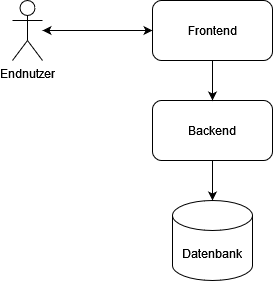
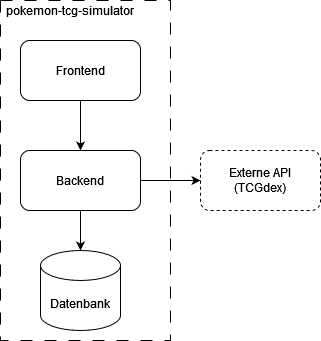
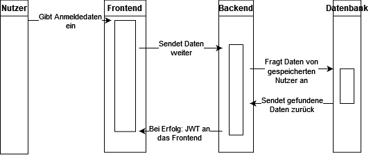
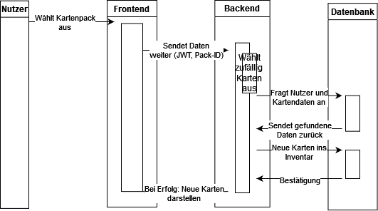
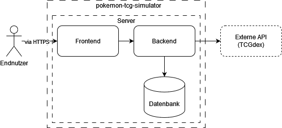

# arc42

## 1. Einführung und Ziele

Das Videospiel ["Pokémon TCG Pocket"](https://tcgpocket.pokemon.com/de-de/), das seit dem 30. Oktober 2024 auf mobilen Endgeräten verfügbar ist, hat durch seine kostenlosen Funktionen, das Sammeln und Tauschen von Karten sowie PvP-Kartenspiele schnell an Popularität gewonnen. Ein zentraler Aspekt des Spiels ist das Öffnen von Kartenpacks, die aus fünf zufälligen Karten bestehen. Diese Karten haben unterschiedliche Raritäten und erscheinen mit festgelegten Wahrscheinlichkeiten.

Das Ziel dieses Projekts ist die Entwicklung einer Simulation, die das Öffnen von Kartenpacks nachbildet. Dabei wird eine vereinfachte Version der Wahrscheinlichkeiten verwendet. Die Simulation dient ausschließlich Demonstrationszwecken und speichert die geöffneten Karten nur im Rahmen der Simulation.

Das Projekt soll folgende Funktionen bereitstellen:

- Simulation des Öffnens von Kartenpacks mit fünf zufälligen Karten aus einem definierten Pool.
- Speicherung der erhaltenen Karten in einem Nutzerprofil.
- Bereitstellung von Login- und Registrierungsfunktionen für Nutzerprofile.
- Gleichverteilung der Wahrscheinlichkeiten für alle Karten (abweichend von der Realität, in der Karten unterschiedliche Wahrscheinlichkeiten haben).

Die Technologieauswahl ist flexibel und wird im weiteren Verlauf der Dokumentation erläutert. Stakeholder des Projekts sind potenzielle Spieler, die an "Pokémon TCG Pocket" interessiert sind. Das Projekt ist unter der [MIT-Lizenz](https://github.com/GreydonDesu/pokemon-tcg-simulator/blob/master/LICENSE) veröffentlicht und dient als Demo für mögliche zukünftige Ideen.

### 1.1 Aufgabenstellung

#### Inhalt

Der Nutzer kann in der Web-App aus einer Liste verfügbarer Kartenpacks ein Kartenpack auswählen und das Öffnen simulieren. Die erhaltenen Karten werden im Nutzerprofil gespeichert. Das Öffnen von Kartenpacks ist nur mit einem angemeldeten Nutzerprofil möglich.

#### Motivation

Das Öffnen von Kartenpacks erzeugt Glücksmomente, ähnlich wie bei Glücksspielmechanismen, was [wissenschaftlich belegt ist](https://www.mdpi.com/2078-2489/14/7/399). In "Pokémon TCG Pocket" ist das Öffnen von Kartenpacks kostenfrei, jedoch mit einer Wartezeit von 12 Stunden verbunden. Diese Wartezeit kann durch den Kauf von Beschleunigern verkürzt werden.

Dieses Projekt bietet eine vereinfachte Simulation des Kartenpack-Öffnens, ohne dass Zeit oder Geld investiert werden muss. Es dient jedoch nicht als realistische Nachbildung des tatsächlichen Spiels, da komplexe Algorithmen und Techniken des Originals nicht berücksichtigt werden.

#### Form

Das Projekt wird als Web-App umgesetzt, sodass keine Installation durch den Nutzer erforderlich ist. Die Persistenz von Daten wie Nutzerprofilen und Inventar sowie die Programmlogik werden im Backend realisiert. Die Kommunikation zwischen Frontend und Backend erfolgt über REST-APIs.

### 1.2 Qualitätsziele

#### Inhalt

Basierend auf der Norm ISO 25010 wurden die folgenden Qualitätsziele für das Projekt definiert:

- **Funktionale Eignung**: Die Funktionen des Projekts sind klar definiert und funktionsfähig.
- **Benutzerfreundlichkeit**: Die Web-App ist intuitiv und ohne zusätzliche Anleitung nutzbar.
- **Kompatibilität**: Die Web-App ist auf verschiedenen Endgeräten und Browsern funktionsfähig.

##### Funktionale Eignung

- Die Funktionen sind selbsterklärend und einfach gehalten.
- Der Fokus liegt auf der Simulation des Kartenpack-Öffnens.
- Zusätzliche Funktionen können später hinzugefügt werden, sind jedoch nicht Teil des aktuellen Scopes.

##### Benutzerfreundlichkeit

- Die Benutzeroberfläche ist so gestaltet, dass die Nutzung intuitiv und ohne Umwege möglich ist.
- Fehlermeldungen sind verständlich und führen den Nutzer zur Lösung.

##### Kompatibilität

- Die Web-App ist auf gängigen Endgeräten und Browsern nutzbar.
- Das Design ist responsiv und passt sich an verschiedene Bildschirmgrößen an.

#### Motivation

Die Definition von Qualitätszielen stellt sicher, dass alle Beteiligten ein gemeinsames Verständnis der Anforderungen und des angestrebten Qualitätsniveaus haben.

#### Form

| Funktionale Eignung | Benutzerfreundlichkeit | Kompatibilität |
|:---:|:---:|:---:|
| Funktionen sind funktionsfähig | Funktionen sind klar erkennbar | Projekt läuft auf gängigen Endgeräten |
| Bedingungen für Funktionen sind abgesichert | Fehlermeldungen sind verständlich | Nutzung ist für die meisten Nutzer einfach |

### 1.3 Stakeholder

#### Inhalt

Die Stakeholder des Projekts lassen sich in drei Gruppen einteilen: Endnutzer, Entwicklung und (optional) Business. Obwohl Business in diesem Projekt keine zentrale Rolle spielt, könnte es in zukünftigen Erweiterungen relevant werden.

##### Endnutzer

- Zielgruppe: Spieler, die an "Pokémon TCG Pocket" interessiert sind.
- Erwartung: Die Web-App ist einfach zu bedienen und erfüllt die definierten Funktionen ohne technische Probleme.

##### Entwicklung

- Zielgruppe: Entwickler, die das Projekt umsetzen und erweitern.
- Erwartung: Klare und verständliche Anforderungen sowie die Freiheit, eigene Ideen einzubringen.

##### Business (optional)

- Zielgruppe: Potenzielle Investoren oder Partner.
- Erwartung: Möglichkeit, das Projekt in Zukunft zu einem Business-Case auszubauen.

#### Motivation

Die Identifikation der Stakeholder hilft, den Fokus des Projekts auf die relevanten Zielgruppen zu richten und deren Erwartungen zu erfüllen.

#### Form

| Rolle | Kontakt | Erwartungshaltung |
|:---:|:---:|---|
| Endnutzer | / | Einfache Nutzung ohne technische Probleme |
| Entwicklung | / | Klare Anforderungen und Freiheit für kreative Lösungen |
| Business | / | Möglichkeit zur Erweiterung des Projekts für kommerzielle Zwecke (optional, nicht im aktuellen Scope) |

## 2. Randbedingungen

### Inhalt

Die folgenden Randbedingungen schränken die Freiheiten in Bezug auf Entwurf, Implementierung und den Entwicklungsprozess ein. Diese Randbedingungen können technischer, organisatorischer oder politischer Natur sein und gelten für das gesamte Projekt.

### Motivation

Um eine tragfähige Architektur zu gewährleisten, ist es wichtig, die bestehenden Einschränkungen und Vorgaben zu kennen. Diese Randbedingungen definieren den Rahmen, in dem das Projekt entwickelt wird, und helfen dabei, realistische und umsetzbare Entscheidungen zu treffen.

### Form

| Kategorie | Randbedingung | Erläuterung |
|:---:|:---:|:---:|
| **Technisch** | Web-App als Plattform | Das Projekt muss als Web-App umgesetzt werden, um eine plattformunabhängige Nutzung zu ermöglichen. |
| |  REST-API für Backend-Kommunikation  | Die Kommunikation zwischen Frontend und Backend erfolgt ausschließlich über REST-APIs. |
| | Datenbank für Persistenz | Eine relationale oder dokumentenbasierte Datenbank wird verwendet, um Nutzerdaten und Inventar zu speichern. |
| **Organisatorisch** | Open-Source-Lizenz (MIT) | Das Projekt ist unter der MIT-Lizenz veröffentlicht, was die freie Nutzung, Modifikation und Verbreitung erlaubt. |
| | Keine langfristige Weiterentwicklung | Das Projekt dient als Demo und wird nicht kontinuierlich weiterentwickelt. |
| **Politisch** | Keine kommerzielle Nutzung | Das Projekt ist nicht für kommerzielle Zwecke gedacht und soll keine Einnahmen generieren. |
| **Übergreifende Regeln** | Einhaltung von Coding-Standards | Der Code muss gut dokumentiert und den gängigen Coding-Standards (z. B. PSR-12 für PHP oder PEP 8 für Python) entsprechen. |

## 3. Kontextabgrenzung

### Inhalt

Die Kontextabgrenzung definiert die Grenzen des Systems und beschreibt die Interaktionen mit externen Kommunikationspartnern, wie Nachbarsystemen und Benutzerrollen. Sie legt die externen Schnittstellen fest und verdeutlicht die Verantwortlichkeiten des Systems. Dabei wird unterschieden zwischen:

- **Fachlichem Kontext**: Ein- und Ausgaben des Systems, die für die Nutzer und Nachbarsysteme relevant sind.
- **Technischem Kontext**: Kanäle, Protokolle und Hardware, die für die Kommunikation genutzt werden.

### Motivation

Die fachlichen und technischen Schnittstellen eines Systems sind entscheidend für dessen Funktionalität und Integration in die Umgebung. Eine klare Definition und ein vollständiges Verständnis dieser Schnittstellen sind notwendig, um Missverständnisse und Fehler zu vermeiden.

### Form

Die Kontextabgrenzung wird durch ein Kontextdiagramm und eine Liste der Kommunikationsbeziehungen dargestellt.

### 3.1 Fachlicher Kontext

Das System interagiert mit den folgenden Benutzerrollen und Nachbarsystemen:

| Benutzerrolle/Nachbarsystem | Beschreibung | Interaktion |
|---|---|---|
| **Endnutzer** | Spieler, die die Web-App nutzen, um Kartenpacks zu öffnen und ihre Karten zu verwalten. | - Anmeldung und Registrierung - Auswahl und Öffnen von Kartenpacks - Anzeige des Inventars |
| **Backend** | Serverseitige Logik, die die Datenverarbeitung und Persistenz übernimmt. | - Speicherung und Abruf von Nutzerdaten und Karten - Bereitstellung der Kartenpack-Simulation |
| **Datenbank** | Persistenzschicht für Nutzerdaten, Karten und Inventar. | - Speicherung und Verwaltung von Nutzerprofilen und Karteninventar |

### 3.2 Technischer Kontext {#_technischer_kontext}

Die Kommunikation zwischen den Komponenten erfolgt über die folgenden Kanäle und Protokolle:

| Komponente | Technologie/Protokoll | Beschreibung |
|:---:|:---:|:---:|
| **Frontend** | HTTP/HTTPS | Kommunikation mit dem Backend über REST-APIs. |
| **Backend** | REST-API | Bereitstellung der Programmlogik und Schnittstellen für das Frontend. |
| **Datenbank** | SQL/NoSQL | Speicherung und Verwaltung der Nutzerdaten und Karteninformationen. |

### 3.3 Kontextdiagramm

Das folgende Diagramm zeigt die Interaktionen zwischen dem System und seinen Nachbarsystemen sowie Benutzerrollen:

Falls Änderungen am Diagramm erforderlich sind, kann die editierbare Version hier heruntergeladen werden:
[Editierbare Version des Diagramms (draw.io)](assets/context_diagram.drawio)

## 4. Lösungsstrategie

### Inhalt

Die Lösungsstrategie beschreibt die grundlegenden Entscheidungen und Ansätze, die den Entwurf und die Implementierung des Systems prägen. Diese umfassen:

- **Technologieentscheidungen**: Auswahl der Technologien für Frontend, Backend und Datenbank.
- **Architekturmuster**: Strukturierung des Systems basierend auf den Anforderungen.
- **Qualitätsanforderungen**: Maßnahmen zur Sicherstellung der definierten Qualitätsziele.
- **Organisatorische Entscheidungen**: Festlegung von Entwicklungsprozessen, Tools und Verantwortlichkeiten.

### Motivation

Die hier getroffenen Entscheidungen bilden die Grundlage für die gesamte Architektur des Systems. Sie beeinflussen sowohl die technische Umsetzung als auch die organisatorischen Abläufe und stellen sicher, dass die definierten Anforderungen und Qualitätsziele erreicht werden.

### Form

Die zentralen Entwurfsentscheidungen werden im Folgenden kurz zusammengefasst und begründet.

### 4.1 Technologieentscheidungen

- Frontend:  
Das Frontend wird mit **Kotlin Multiplatform** entwickelt. Diese Technologie ermöglicht die Wiederverwendbarkeit von Code und bietet eine moderne, flexible Lösung für die plattformübergreifende Entwicklung. Die Wahl basiert auf der Erfahrung des Entwicklers mit Android Compose, das ähnliche Konzepte verwendet.
- Backend:  
Das Backend wird mit **Spring Boot** in **Kotlin** umgesetzt. Spring Boot bietet eine robuste Grundlage für die Entwicklung von REST-APIs und ist durch den Spring Initializer leicht erweiterbar. Die Wahl von Kotlin als Programmiersprache basiert auf der Präferenz des Entwicklers und der besseren Lesbarkeit im Vergleich zu Java.
- Datenbank:  
Für die Persistenz wird **MongoDB** verwendet. MongoDB ist eine dokumentenbasierte NoSQL-Datenbank, die sich durch Flexibilität und einfache Integration mit Spring Boot auszeichnet.
- Externe API:  
Die Karteninformationen werden über die externe API **TCGdex** bezogen. Diese API bietet die notwendigen Daten für die Simulation des Kartenpack-Öffnens.
- Kommunikation:  
Die Kommunikation zwischen Frontend und Backend erfolgt über **REST-APIs** mit JSON als Datenaustauschformat.

### 4.2 Architekturmuster

Das System folgt einer **Client-Server-Architektur**, die die Trennung von Frontend und Backend ermöglicht. Dies erleichtert die Wartung und zukünftige Erweiterungen. Die wichtigsten Komponenten sind:

- **Frontend**: Präsentationsschicht, die die Benutzeroberfläche bereitstellt.
- **Backend**: Logik- und Verarbeitungsschicht, die die Geschäftslogik und Datenverarbeitung übernimmt.
- **Datenbank**: Persistenzschicht, die Nutzerdaten und Karteninformationen speichert.
- **Externe API**: Datenquelle für Karteninformationen.

### 4.3 Maßnahmen zur Erreichung der Qualitätsanforderungen

- Funktionale Eignung:
    - Die definierten Funktionen werden durch Unit-Tests und Integrationstests sichergestellt.
    - Die API-Endpunkte zwischen Frontend und Backend sind klar dokumentiert, um eine reibungslose Kommunikation zu gewährleisten.
- Benutzerfreundlichkeit:
    - Das Frontend wird mit einem responsiven Design entwickelt, um eine optimale Nutzung auf verschiedenen Endgeräten zu ermöglichen.
    - Die Benutzeroberfläche wird intuitiv gestaltet, um eine einfache Bedienung zu gewährleisten.
- Kompatibilität:
    - Die Web-App wird in gängigen Browsern (z. B. Chrome, Firefox, Safari) getestet.
    - Die Integration von Kotlin Multiplatform ermöglicht eine plattformübergreifende Nutzung.
- Codequalität:
    - **Codacy** wird als Tool für die Code-Qualitätssicherung verwendet. Es bietet Linting und Code-Analyse für Kotlin und ist kostenlos für Open-Source-Projekte.
    - **JaCoCo** wird für die Testabdeckung eingesetzt und liefert Berichte, die in Codacy integriert werden können.

### 4.4 Organisatorische Entscheidungen

- Entwicklungsprozess:  
Es wird ein agiler Entwicklungsprozess (z. B. Scrum oder Kanban) verwendet, um flexibel auf Änderungen reagieren zu können.
- Versionierung:  
Der Code wird in einem **Git-Repository** verwaltet, um eine klare Nachverfolgbarkeit von Änderungen zu gewährleisten.
- Dokumentation:  
Die API-Endpunkte und Datentypen werden klar dokumentiert, um die Zusammenarbeit zwischen Frontend und Backend zu erleichtern.
- Verantwortlichkeiten:  
    - Das Frontend wird von Entwicklern mit Erfahrung in Kotlin Multiplatform umgesetzt.
    - Das Backend wird von Entwicklern mit Erfahrung in Spring Boot und MongoDB entwickelt.
    - Die Qualitätssicherung wird durch die Integration von Codacy und JaCoCo sichergestellt.

## 5. Bausteinsicht

### 5.1 Whitebox Gesamtsystem

#### Übersichtsdiagramm

Das folgende Diagramm zeigt die statische Zerlegung des Systems in seine Hauptbausteine und die Kommunikationsflüsse:

Falls Änderungen am Diagramm erforderlich sind, kann die editierbare Version hier heruntergeladen werden:
[Editierbare Version des Diagramms (draw.io)](assets/overview_diagram.drawio)

##### Erklärung der Pfeile

- Frontend ↔ Backend:  
Das Frontend kommuniziert mit dem Backend über REST-API-Endpunkte, z. B. für die Anmeldung, das Abrufen des Inventars oder das Öffnen von Kartenpacks.
- Backend ↔ Datenbank:  
Das Backend speichert und liest Daten (z. B. Nutzerinformationen, Karten und Sets) in der Datenbank.
- Backend ↔ Externe API (TCGdex):  
Das Backend ruft Daten (z. B. Kartensets und Karteninformationen) von der externen API ab und verarbeitet diese, bevor sie in der Datenbank gespeichert oder an das Frontend weitergeleitet werden.

#### Begründung der Zerlegung

Das System wurde in folgende Hauptbausteine zerlegt, um die Verantwortlichkeiten klar zu trennen und die Wartbarkeit sowie Erweiterbarkeit zu gewährleisten:

- **Frontend**: Präsentationsschicht, die die Benutzeroberfläche bereitstellt und mit dem Backend kommuniziert.
- **Backend**: Logik- und Verarbeitungsschicht, die die Geschäftslogik übernimmt, Daten aus der externen API (TCGdex) bezieht und mit der Datenbank interagiert.
- **Datenbank**: Persistenzschicht, die Nutzerdaten, Karten und Inventar speichert.
- **Externe API (TCGdex)**: Datenquelle für Karteninformationen, die vom Backend abgerufen werden.

### 5.2 Enthaltene Bausteine

| Name | Verantwortung |
|:---:|:---:|
| **Frontend** | Präsentation der Benutzeroberfläche und Kommunikation mit dem Backend. |
| **Backend** | Verarbeitung der Geschäftslogik, Authentifizierung, Kommunikation mit der Datenbank und der externen API. |
| **Datenbank** | Speicherung von Nutzerdaten, Karten und Inventar. |
| **Externe API** | Bereitstellung von Karteninformationen für die Simulation des Kartenpack-Öffnens. |

### 5.3 Blackbox-Beschreibungen

#### Frontend

- **Zweck/Verantwortung**:  
Das Frontend stellt die Benutzeroberfläche bereit und ermöglicht Nutzern die Anmeldung, das Öffnen von Kartenpacks und die Verwaltung ihres Inventars.
- **Schnittstellen**:
    - REST-API-Aufrufe an das Backend.

#### Backend

- **Zweck/Verantwortung**:  
Das Backend verarbeitet die Geschäftslogik, authentifiziert Nutzer, kommuniziert mit der Datenbank und ruft Daten von der externen API (TCGdex) ab.
- **Schnittstellen**:
    - REST-APIs für das Frontend (z. B. /api/accounts/login, /api/packs/open).
    - Datenbankzugriff (MongoDB).
    - HTTP-Kommunikation mit der externen API (TCGdex).

#### Datenbank

- **Zweck/Verantwortung**:  
Die Datenbank speichert Nutzerdaten, Karten und Inventar.
- **Schnittstellen**:
    - Zugriff durch das Backend über MongoDB-Treiber.

#### Externe API (TCGdex)

- **Zweck/Verantwortung**:  
Die API stellt Informationen über Karten und Kartensets bereit, die vom Backend abgerufen werden.
- **Schnittstellen**:
    - HTTP-REST-API-Aufrufe durch das Backend.

### 5.4 Begründung der Zerlegung

Die Zerlegung in Frontend, Backend, Datenbank und externe API wurde gewählt, um folgende Ziele zu erreichen:

- **Trennung der Verantwortlichkeiten**: Jede Komponente hat klar definierte Aufgaben, was die Wartbarkeit und Erweiterbarkeit erleichtert.
- **Skalierbarkeit**: Die Architektur ermöglicht eine einfache horizontale Skalierung, insbesondere durch die Trennung von Backend und Datenbank.
- **Flexibilität**: Die Integration der externen API (TCGdex) ermöglicht die Nutzung aktueller Kartendaten ohne eigene Datenpflege.

## 6. Laufzeitsicht

### 6.1 Szenario 1: Anmeldung eines Nutzers

#### Ablaufbeschreibung

1. Der Nutzer gibt seinen Nutzernamen und sein Passwort im Frontend ein.
2. Das Frontend sendet die Anmeldedaten (Nutzername und gehashtes Passwort) an den Endpunkt /api/accounts/login des Backends.
3. Das Backend validiert die Anmeldedaten:
    - Es überprüft, ob der Nutzername in der Datenbank existiert.
    - Es vergleicht das gehashte Passwort mit dem in der Datenbank gespeicherten Hash.
4. Bei erfolgreicher Validierung generiert das Backend ein JWT (JSON Web Token) und sendet es an das Frontend.
5. Das Frontend speichert das JWT und verwendet es für zukünftige Anfragen.

#### Sequenzdiagramm

Falls Änderungen am Diagramm erforderlich sind, kann die editierbare Version hier heruntergeladen werden:
[Editierbare Version des Diagramms (draw.io)](assets/scenario1.drawio)

### 6.2 Szenario 2: Öffnen eines Kartenpacks

#### Ablaufbeschreibung

1. Der Nutzer wählt ein Kartenpack im Frontend aus und sendet die Anfrage an den Endpunkt /api/packs/open des Backends. Die Anfrage enthält:
    - Das JWT zur Authentifizierung.
    - Die ID des ausgewählten Kartensets.
2. Das Backend validiert das JWT und extrahiert den Nutzernamen.
3. Das Backend generiert eine zufällige Auswahl von Karten aus dem angegebenen Kartenset.
4. Die ausgewählten Karten werden im Inventar des Nutzers in der Datenbank gespeichert.
5. Das Backend sendet die Karteninformationen an das Frontend.
6. Das Frontend zeigt die Karten dem Nutzer an.

#### Sequenzdiagramm

Falls Änderungen am Diagramm erforderlich sind, kann die editierbare Version hier heruntergeladen werden:
[Editierbare Version des Diagramms (draw.io)](assets/scenario2.drawio)

### 6.3 Szenario 3: Abruf des Inventars

#### Ablaufbeschreibung

1. Der Nutzer sendet eine Anfrage an den Endpunkt /api/accounts/inventory des Backends. Die Anfrage enthält das JWT zur Authentifizierung.
2. Das Backend validiert das JWT und extrahiert den Nutzernamen.
3. Das Backend ruft das Inventar des Nutzers aus der Datenbank ab.
4. Das Backend sendet die Inventardaten an das Frontend.
5. Das Frontend zeigt das Inventar dem Nutzer an.

#### Sequenzdiagramm

> WIP

<!-- 

Falls Änderungen am Diagramm erforderlich sind, kann die editierbare Version hier heruntergeladen werden:
[Editierbare Version des Diagramms (draw.io)](assets/scenario3.drawio) -->

### 6.4 Szenario 4: Abruf von Kartensets

#### Ablaufbeschreibung

1. Das Frontend sendet eine Anfrage an den Endpunkt /api/sets des Backends, um die verfügbaren Kartensets abzurufen.
2. Das Backend ruft die Kartenset-Daten aus der Datenbank ab.
3. Das Backend sendet die Kartenset-Daten an das Frontend.
4. Das Frontend zeigt die Kartensets dem Nutzer an.

#### Sequenzdiagramm

> WIP

<!-- 

Falls Änderungen am Diagramm erforderlich sind, kann die editierbare Version hier heruntergeladen werden:
[Editierbare Version des Diagramms (draw.io)](assets/scenario4.drawio) -->

### 6.5 Szenario 5: Abruf von Kartenbildern

#### Ablaufbeschreibung

1. Das Frontend sendet eine Anfrage an den Endpunkt /images/{fileName} des Backends, um ein Kartenbild abzurufen.
2. Das Backend sucht das angeforderte Bild im lokalen Dateisystem.
3. Das Backend sendet das Bild an das Frontend.
4. Das Frontend zeigt das Bild dem Nutzer an.

#### Sequenzdiagramm

> WIP

<!-- 

Falls Änderungen am Diagramm erforderlich sind, kann die editierbare Version hier heruntergeladen werden:
[Editierbare Version des Diagramms (draw.io)](assets/scenario5.drawio) -->

## 7. Verteilungssicht

### 7.1 Infrastruktur Ebene 1

#### Übersichtsdiagramm

Das folgende Verteilungsdiagramm zeigt die Verteilung des Systems auf die technische Infrastruktur. Es umfasst die Entwicklungs-, Test- und Produktionsumgebungen sowie die Zuordnung der Softwarebausteine zu den Infrastrukturkomponenten.

Falls Änderungen am Diagramm erforderlich sind, kann die editierbare Version hier heruntergeladen werden:
[Editierbare Version des Diagramms (draw.io)](assets/distributed_diagram.drawio)

#### Beschreibung der Infrastruktur

1. **Endnutzer (Client)**:
    - **Typ**: Browser oder mobiler Client.
    - **Funktion**: Verbindung zum Frontend-Server über HTTPS, um die Benutzeroberfläche zu nutzen.
    - **Beispielumgebung**: Lokaler Rechner des Nutzers oder mobiles Endgerät.

2. **Frontend-Server**:
    - **Typ**: Server, auf dem das Frontend (z. B. eine React- oder Angular-Anwendung) gehostet wird.
    - **Funktion**: Bereitstellung der Benutzeroberfläche als Website, die über HTTPS erreichbar ist.
    - **Beispielumgebung**: Cloud-Server (z. B. AWS S3 mit CloudFront, Azure Static Web Apps) oder lokaler Webserver.

3. **Backend-Server**:
    - **Typ**: Server, auf dem die Spring Boot-Anwendung läuft.
    - **Funktion**: Verarbeitung der Geschäftslogik, Authentifizierung, Kommunikation mit der Datenbank und der externen API.
    - **Beispielumgebung**: Cloud-Server (z. B. AWS EC2, Azure VM) oder lokaler Server.

4. **Datenbank-Host**:
    - **Typ**: Server, auf dem MongoDB läuft.
    - **Funktion**: Speicherung von Nutzerdaten, Karten und Inventar.
    - **Beispielumgebung**: Cloud-Datenbank (z. B. MongoDB Atlas) oder lokaler Datenbankserver.

5. **Externe API (TCGdex)**:
    - **Typ**: Externer Dienst.
    - **Funktion**: Bereitstellung von Karten- und Kartenset-Daten.
    - **Beispielumgebung**: Öffentliche API, erreichbar über das Internet.

#### Begründung der Verteilungsstruktur

- **Trennung der Verantwortlichkeiten**:  
Die Verteilung auf separate Server ermöglicht eine klare Trennung der Präsentations-, Geschäfts- und Persistenzschichten.
- **Skalierbarkeit**:  
Die Architektur erlaubt eine horizontale Skalierung, z. B. durch das Hinzufügen weiterer Backend- oder Frontend-Server.
- **Flexibilität**:  
Die Nutzung einer externen API (TCGdex) reduziert den Wartungsaufwand für Kartendaten und ermöglicht die Integration aktueller Informationen.

#### Qualitäts- und Leistungsmerkmale

- **Verfügbarkeit**:  
    - Die Infrastruktur ist so ausgelegt, dass sie eine hohe Verfügbarkeit gewährleistet, z. B. durch den Einsatz von Cloud-Diensten mit automatischer Skalierung.
- **Sicherheit**:  
    - Die Kommunikation zwischen den Komponenten erfolgt über HTTPS, um die Datenintegrität und Vertraulichkeit zu gewährleisten.
    - JWT-basierte Authentifizierung schützt die Backend-Endpunkte vor unbefugtem Zugriff.
- **Performance**:
    - Das Frontend wird als statische Website gehostet, was schnelle Ladezeiten ermöglicht.
    - Die Datenbank (MongoDB) ist für schnelle Lese- und Schreiboperationen optimiert.
    - Die externe API (TCGdex) wird nur bei Bedarf abgefragt, um die Latenz zu minimieren.

### 7.2 Infrastruktur Ebene 2

#### Frontend-Server

Das Frontend wird auf einem Server gehostet, der folgende Eigenschaften aufweist:

- **Bereitstellung**:
    - Das Frontend wird als statische Website (z. B. React, Angular) bereitgestellt.
    - Der Server ist über HTTPS erreichbar.
- **Beispielumgebung**:
    - Cloud-Hosting (z. B. AWS S3 mit CloudFront, Azure Static Web Apps).
    - Alternativ: Ein dedizierter Webserver (z. B. Nginx oder Apache).
- **Sicherheitsmaßnahmen**:
    - HTTPS für die Kommunikation mit den Nutzern.
    - Firewall-Regeln, um den Zugriff auf den Server zu beschränken.

#### Backend-Server

Das Backend wird auf einem Server ausgeführt, der folgende Komponenten umfasst:

- **Spring Boot-Anwendung**:
    - Bereitstellung der REST-APIs.
    - Verarbeitung der Geschäftslogik.
    - Kommunikation mit der Datenbank und der externen API.
- **Sicherheitsmaßnahmen**:
    - HTTPS für die Kommunikation mit dem Frontend.
    - Firewall-Regeln, um den Zugriff auf die Backend-Server zu beschränken.

#### Datenbank-Host

Die Datenbank (MongoDB) wird auf einem separaten Server oder in einer Cloud-Umgebung (z. B. MongoDB Atlas) ausgeführt:

- **Datenstruktur**:
    - Speicherung von Nutzerdaten, Karten und Kartensets.
    - Optimierung für schnelle Abfragen und Schreiboperationen.
- **Sicherheitsmaßnahmen**:
    - Zugriff nur über das Backend.
    - Authentifizierung und Verschlüsselung der Daten.

## 8. Querschnittliche Konzepte

### 8.1 Fachliche Konzepte

#### Modellierung der Karten und Kartensets

- **Beschreibung**:  
Karten und Kartensets sind zentrale fachliche Entitäten des Systems. Sie werden in der Datenbank als Dokumente gespeichert und enthalten Attribute wie `id`, `name`, `image` (für Karten) und `totalCards`, `releaseDate` (für Kartensets).
- **Ziel**:  
Einheitliche Modellierung und Verarbeitung dieser Entitäten im gesamten System.
- **Umsetzung**:  
    - Verwendung von **DTOs (Data Transfer Objects)**, um die Daten zwischen Backend und Frontend zu übertragen.
    - Speicherung der Entitäten in **MongoDB** als JSON-Dokumente.

### 8.2 Sicherheitskonzepte

#### JWT-basierte Authentifizierung

- **Beschreibung**:  
Die Authentifizierung erfolgt über JSON Web Tokens (JWT), die bei der Anmeldung eines Nutzers generiert werden. Diese Tokens werden für alle nachfolgenden Anfragen verwendet, um den Nutzer zu identifizieren.
- **Ziel**:  
Schutz der REST-APIs vor unbefugtem Zugriff.
- **Umsetzung**:
    - **Token-Generierung**: Beim erfolgreichen Login wird ein JWT generiert und an den Client zurückgegeben.
    - **Token-Validierung**: Bei jeder Anfrage wird das JWT im Header (Authorization: `Bearer <Token>`) überprüft.
    - **Sicherheitsmaßnahmen**:
        - Tokens sind zeitlich begrenzt gültig.
        - Die Signatur des Tokens wird mit einem geheimen Schlüssel validiert.

### 8.3 Architektur- und Entwurfsmuster

#### Schichtenarchitektur

- **Beschreibung**:  
Das System folgt einer Schichtenarchitektur, die die Verantwortlichkeiten klar trennt:
    - **Präsentationsschicht**: Frontend (React/Angular).
    - **Geschäftslogik**: Backend (Spring Boot).
    - **Persistenzschicht**: Datenbank (MongoDB).
- **Ziel**:
    - Verbesserung der Wartbarkeit und Erweiterbarkeit.
    - Klare Trennung der Verantwortlichkeiten.

#### DTOs (Data Transfer Objects)

- **Beschreibung**:  
DTOs werden verwendet, um Daten zwischen Backend und Frontend zu übertragen. Sie enthalten nur die notwendigen Informationen und abstrahieren die internen Datenmodelle.
- **Ziel**:
    - Reduzierung der Datenmenge, die über das Netzwerk übertragen wird.
    - Schutz der internen Datenstrukturen vor direktem Zugriff.

### 8.4 Entwicklungskonzepte

#### Code-Qualität und Standards

- **Beschreibung**:  
Einheitliche Code-Standards und Best Practices werden im gesamten Projekt angewendet.
- **Ziel**:
    - Verbesserung der Lesbarkeit und Wartbarkeit des Codes.
    - Vermeidung von Fehlern durch inkonsistente Implementierungen.
- **Umsetzung**:
    - Verwendung von Code-Linter (z. B. ESLint für das Frontend, Checkstyle für das Backend).
    - Automatische Code-Formatierung (z. B. Prettier, Google Java Format).

#### Teststrategie

- **Beschreibung**:  
Das System wird durch automatisierte Tests abgesichert.
- **Ziel**:
    - Sicherstellung der Funktionalität und Vermeidung von Regressionen.
- **Umsetzung**:
    - **Unit-Tests**: Für einzelne Komponenten (z. B. Services, Controller).
    - **Integrationstests**: Für die Interaktion zwischen Backend und Datenbank.
    - **End-to-End-Tests**: Für die vollständige Benutzerinteraktion (z. B. Cypress für das Frontend).

## 9. Architekturentscheidungen

### Inhalt

Dieser Abschnitt dokumentiert die wichtigsten Architekturentscheidungen, die während der Entwicklung des Pokémon TCG-Simulators getroffen wurden. Die Entscheidungen wurden in Form von Architecture Decision Records (ADRs) festgehalten, um die Auswahl zwischen Alternativen und die zugrunde liegenden Kriterien nachvollziehbar zu machen.

Die vollständige Liste der ADRs ist unter folgendem Link verfügbar: [ADRs](https://pokemon-tcg-simulator.readthedocs.io/de/latest/adr/0001-record-architecture-decisions/)

### Übersicht der wichtigsten Entscheidungen

| Entscheidung | Begründung | Alternativen |
|:---:|:---:|---|
| **Wahl von Spring Boot** | Robuste Grundlage für REST-APIs, große Community, einfache Integration. | Micronaut, Quarkus |
| **Verwendung von MongoDB** | Flexibilität für dokumentenbasierte Daten, einfache Skalierbarkeit. | PostgreSQL, Cassandra |
| **Rest als API-Standard** | Einfachheit, breite Unterstützung in Tools und Frameworks. | GraphQL, gRPC |
| **JWT-basierte Authentifizierung** | Sicherer und standardisierter Ansatz für die Nutzeridentifikation. | Session-basierte Authentifizierung |
| **Docker für Containerisierung** | Standardlösung für Containerisierung, breite Unterstützung. | Podman, VMs |

### Motivation

Die Dokumentation der Architekturentscheidungen dient mehreren Zwecken:

- **Nachvollziehbarkeit**: Stakeholder können die Gründe für die Entscheidungen verstehen und bewerten.
- **Wissensmanagement**: Entscheidungen und ihre Begründungen bleiben auch bei Personalwechsel erhalten.
- **Risikomanagement**: Risiken und Alternativen werden explizit gemacht, um fundierte Entscheidungen zu treffen.
- **Kommunikation**: Entscheidungen können klar und einheitlich kommuniziert werden.

### Form

Die Architekturentscheidungen wurden in Form von ADRs dokumentiert. Ein ADR enthält:

- **Titel**: Kurzbeschreibung der Entscheidung.
- **Kontext**: Beschreibung der Situation, die zur Entscheidung geführt hat.
- **Entscheidung**: Die getroffene Wahl.
- **Begründung**: Warum wurde diese Wahl getroffen?
- **Alternativen**: Welche Alternativen wurden in Betracht gezogen und warum wurden sie verworfen?

Beispiel für ein ADR: [1 - Record architecture decisions](https://pokemon-tcg-simulator.readthedocs.io/de/latest/adr/0001-record-architecture-decisions/)

## 10. Qualitätsanforderungen

### Inhalt

Dieser Abschnitt beschreibt die Qualitätsanforderungen des Pokémon TCG-Simulators. Die wichtigsten Qualitätsziele wurden bereits in Abschnitt 1.2 (Qualitätsziele) hervorgehoben. Hier werden diese Anforderungen weiter verfeinert und durch zusätzliche Anforderungen ergänzt, die eine geringere Priorität haben, aber dennoch relevant sind.

Die Qualitätsanforderungen werden in Form eines Qualitätsbaums dargestellt und durch konkrete Qualitätsszenarien operationalisiert.

### Motivation

Qualitätsanforderungen beeinflussen maßgeblich die Architekturentscheidungen und die technische Umsetzung des Systems. Sie stellen sicher, dass die Erwartungen der Stakeholder erfüllt werden und das System langfristig wartbar, erweiterbar und benutzerfreundlich bleibt.

### 10.2 Qualitätsbaum

Der folgende Qualitätsbaum gibt einen Überblick über die Qualitätsanforderungen des Systems. Die Wurzel des Baums ist der Begriff „Qualität“, der in verschiedene Hauptzweige (z. B. Funktionalität, Benutzerfreundlichkeit, Kompatibilität) unterteilt wird. Die Blätter des Baums enthalten konkrete Qualitätsszenarien.

#### Qualitätsbaum (Übersicht)

- **Qualität**
    - **Funktionalität**
        - Das System ermöglicht die Simulation des Kartenpack-Öffnens.
        - Die REST-API-Endpunkte sind funktionsfähig und liefern korrekte Ergebnisse.
    - **Benutzerfreundlichkeit**
        - Die Web-App ist intuitiv bedienbar.
        - Fehlermeldungen sind verständlich und führen den Nutzer zur Lösung.
    - **Kompatibilität**
        - Die Web-App funktioniert auf gängigen Browsern und Endgeräten.
        - Das Design ist responsiv und passt sich an verschiedene Bildschirmgrößen an.
    - **Performance**
        - API-Anfragen werden innerhalb von 500 ms beantwortet.
        - Die Web-App lädt innerhalb von 2 Sekunden auf einem durchschnittlichen Gerät.
    - **Sicherheit**
        - Die Authentifizierung erfolgt über JWT und schützt vor unbefugtem Zugriff.
        - Sensible Daten werden verschlüsselt übertragen.
    - **Wartbarkeit**
        - Der Code ist gut dokumentiert und folgt gängigen Standards.
        - Neue Funktionen können innerhalb von 2 Tagen implementiert werden.

### 10.3 Qualitätsszenarien

Qualitätsszenarien konkretisieren die Anforderungen und beschreiben, wie das System auf bestimmte Auslöser reagieren soll. Sie werden in zwei Kategorien unterteilt:

1. **Nutzungsszenarien**: Beschreiben, wie das System zur Laufzeit auf einen bestimmten Stimulus reagiert.
2. **Änderungsszenarien**: Beschreiben, wie das System auf Änderungen in der Umgebung oder den Anforderungen reagiert.

#### 10.3.1 Nutzungsszenarien

| ID | Szenario | Stimulus | Reaktion | Messkriterium |
|:---:|:---:|---|---|---|
| N1 | Ein Nutzer meldet sich an. | Der Nutzer sendet Anmeldedaten an die API. | Das System validiert die Daten und gibt ein JWT zurück. | Antwortzeit < 500 ms. |
| N2 | Ein Nutzer öffnet ein Kartenpack. | Der Nutzer sendet eine Anfrage an die API. | Das System generiert Karten, speichert sie im Inventar und gibt die Karteninformationen zurück. | Antwortzeit < 500 ms. |
| N3 | Ein Nutzer ruft sein Inventar ab. | Der Nutzer sendet eine Anfrage an die API. | Das System liefert die gespeicherten Karten aus der Datenbank. | Antwortzeit < 500 ms. |
| N4 | Ein Nutzer greift auf die Web-App zu. | Der Nutzer öffnet die Web-App im Browser. | Die Web-App wird geladen und ist innerhalb von 2 Sekunden nutzbar. | Ladezeit < 2 Sekunden. |
| N5 | Ein Nutzer versucht, ohne Authentifizierung auf einen geschützten Endpunkt zuzugreifen. | Der Nutzer sendet eine Anfrage ohne JWT. | Das System verweigert den Zugriff und gibt den HTTP-Statuscode 403 zurück. | Zugriff wird verweigert (403). |

#### 10.3.2 Änderungsszenarien

| ID | Szenario | Stimulus | Reaktion | Messkriterium |
|:---:|:---:|---|---|---|
| A1 | Eine neue Kartenrarität wird hinzugefügt. | Eine neue Kartenrarität wird definiert. | Das System wird angepasst, um die neue Rarität zu unterstützen. | Implementierung in < 2 Tagen. |
| A2 | Ein neuer Endpunkt für die API wird benötigt. | Eine neue Funktionalität wird angefordert. | Der Endpunkt wird implementiert und dokumentiert. | Implementierung in < 2 Tagen. |
| A3 | Die Datenbank wird von MongoDB auf PostgreSQL umgestellt. | Die Datenbanktechnologie wird geändert. | Das System wird angepasst, um die neue Datenbank zu unterstützen. | Migration in < 5 Tagen. |
| A4 | Ein neues Frontend-Framework wird eingeführt. | Das Frontend wird auf ein neues Framework migriert. | Die Web-App wird mit dem neuen Framework umgesetzt. | Migration in < 10 Tagen. |

## 11. Risiken und technische Schulden

### Inhalt

Dieser Abschnitt listet die identifizierten Architekturrisiken und technischen Schulden des Pokémon TCG-Simulators auf. Die Risiken und Schulden werden priorisiert und, falls möglich, mit Maßnahmen zur Risikovermeidung oder -minimierung sowie zum Abbau der technischen Schulden versehen.

### 11.1 Risiken

| ID | Risiko | Auswirkung | Wahrscheinlichkeit | Priorität | Maßnahmen |
|:---:|:---:|---|---|---|---|
| R1 | **Externe API (TCGdex) ist nicht verfügbar** | Die Karteninformationen können nicht abgerufen werden, was die Simulation blockiert. | Mittel | Hoch | - Caching der Kartendaten im Backend - Fallback-Datenbank mit häufig genutzten Karten |
| R2 | **Skalierungsprobleme bei hoher Nutzerlast** | Die Performance des Systems sinkt, was zu langen Ladezeiten oder Ausfällen führt. | Hoch | Hoch | - Lasttests durchführen - Horizontale Skalierung des Backends - Nutzung des Load-Balancers |
| R3 | **Sicherheitslücken in der JWT-Authentifizierung** | Unbefugter Zugriff auf geschützte Endpunkte, was sensible Nutzerdaten gefährden könnte. | Mittel | Hoch | - Regelmäßige Sicherheitsprüfungen - Tokens mit kurzer Lebensdauer - Einsatz von HTTPS |
| R4 | **Datenverlust durch fehlerhafte Datenbankkonfiguration** | Nutzerdaten und Inventare könnten verloren gehen. | Mittel | Mittel | - Regelmäßige Backups - Replikation der Datenbank - Monitoring der Datenbankintegrität |
| R5 | **Technologieabhängigkeit von MongoDB** | Ein Wechsel der Datenbanktechnologie könnte aufwendig und teuer sein. | Niedrig | Mittel | - Abstraktion der Datenbankzugriffe - Dokumentation der Datenbankstruktur |
| R6 | **Fehlende Browserkompatibilität** | Die Web-App funktioniert nicht auf allen gängigen Browsern. | Mittel | Mittel | - Cross-Browser-Tests - Nutzung von standardkonformen Technologien |

### 11.2 Schulden

| ID | Technische Schuld | Auswirkung | Priorität | Maßnahmen |
|:---:|:---:|---|---|---|
| T1 | **Fehlende Testabdeckung für Integrationstests** | Fehler in der Kommunikation zwischen Backend und Datenbank könnten unentdeckt bleiben. | Hoch | - Einführung von Integrationstests - Nutzung von Test-Frameworks wie JUnit und Mockito |
| T2 | **Hardcodierte Konfigurationswerte** | Änderungen an Umgebungsvariablen erfordern Codeänderungen. | Mittel | - Nutzung eines Konfigurationsmanagements (z. B. Spring Profiles) |
| T3 | **Unzureichende Dokumentation der REST-API** | Entwickler könnten Schwierigkeiten bei der Nutzung oder Erweiterung der API haben. | Mittel | - Erstellung einer API-Dokumentation mit Swagger oder OpenAPI |
| T4 | **Monolithische Struktur des Backends** | Die Wartbarkeit und Skalierbarkeit des Systems wird erschwert. | Mittel | - Modularisierung des Backends - Einführung von Microservices bei Bedarf |
| T5 | **Veraltete Abhängigkeiten** | Sicherheits- und Kompatibilitätsprobleme durch veraltete Bibliotheken. | Mittel | - Regelmäßige Updates der Abhängigkeiten - Nutzung von Tools wie Dependabot |
| T6 | **Fehlende Automatisierung im Deployment** | Manuelle Deployments sind fehleranfällig und zeitaufwendig. | Mittel | - Einführung von CI/CD-Pipelines (z. B. mit GitHub Actions oder Jenkins) |

## 12. Glossar

### Inhalt

Das Glossar definiert die wesentlichen fachlichen und technischen Begriffe, die im Zusammenhang mit dem Pokémon TCG-Simulator verwendet werden. Es dient als Referenz, um sicherzustellen, dass alle Stakeholder die Begriffe einheitlich verstehen.

| Begriff | Definition |
|:---:|---|
| Kartenpack | Eine Sammlung von fünf zufälligen Karten, die der Nutzer in der Simulation öffnen kann. |
| Kartenrarität | Die Seltenheit einer Karte, z. B. „Common“, „Rare“, „Ultra Rare“. |
| JWT (JSON Web Token) | Ein Token-Format zur Authentifizierung, das Informationen über den Nutzer enthält. |
| REST-API | Eine API, die auf den Prinzipien von REST (Representational State Transfer) basiert. |
| MongoDB | Eine dokumentenbasierte NoSQL-Datenbank, die für die Speicherung von Nutzerdaten verwendet wird. |
| Frontend | Die Benutzeroberfläche der Web-App, die im Browser ausgeführt wird. |
| Backend | Die serverseitige Logik, die die Geschäftslogik und Datenverarbeitung übernimmt. |
| Swagger/OpenAPI | Tools zur Dokumentation und Visualisierung von REST-APIs. |
| CI/CD | Continuous Integration/Continuous Deployment, ein Prozess zur Automatisierung von Builds, Tests und Deployments. |
| TCGdex | Eine externe API, die Karten- und Kartenset-Daten für die Simulation bereitstellt. |

## Über arc42

arc42, das Template zur Dokumentation von Software- und
Systemarchitekturen.

Template Version 8.2 DE. (basiert auf AsciiDoc Version), Januar 2023

Created, maintained and © by Dr. Peter Hruschka, Dr. Gernot Starke and
contributors. Siehe <https://arc42.org>.
